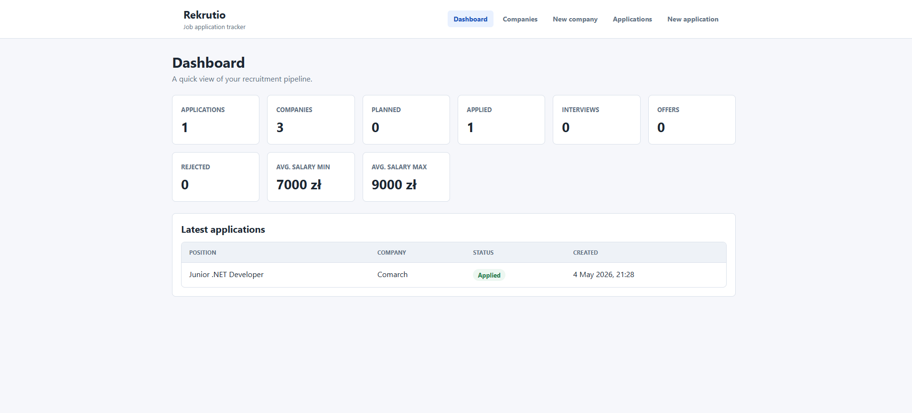
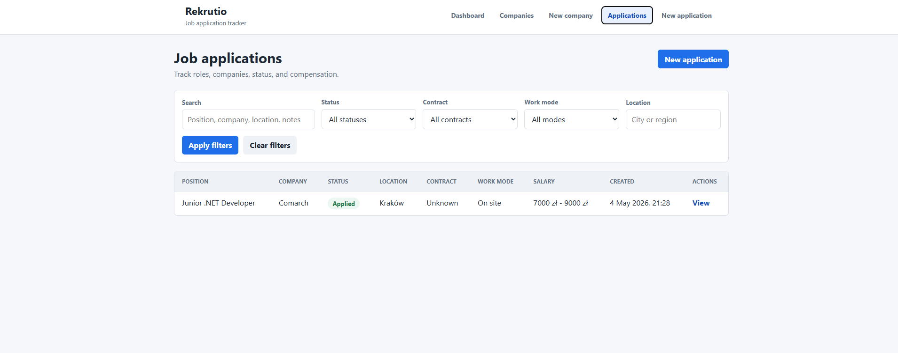
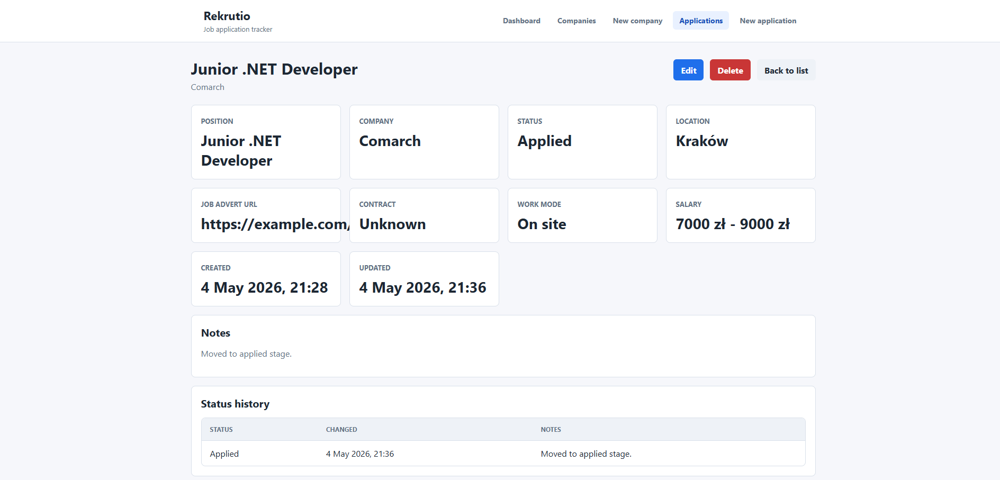
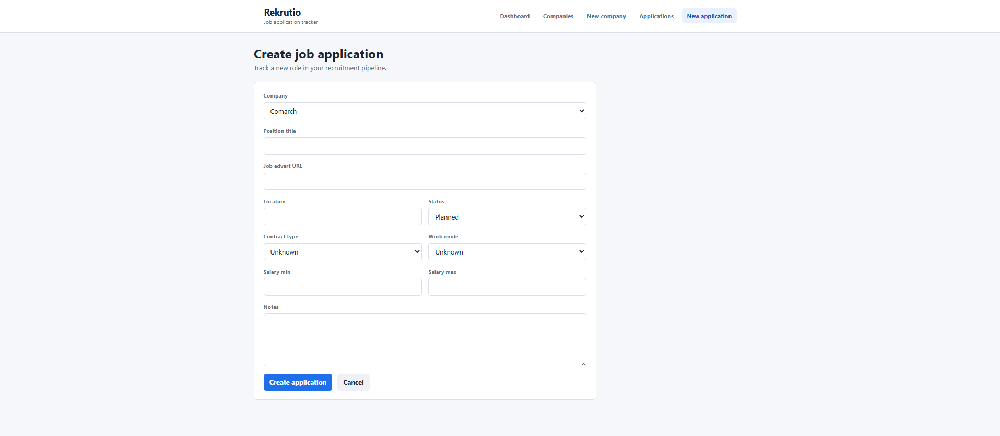

# Rekrutio

Rekrutio is a Polish job application tracker built as a junior .NET developer portfolio project. It helps track companies, job applications, application statuses, salary ranges, and recent recruitment activity.

The project currently includes an ASP.NET Core Web API backend and a React + TypeScript frontend. Authentication and advanced user features are intentionally not included yet.

## Tech Stack

**Backend**

- ASP.NET Core Web API
- C#
- .NET 8
- Entity Framework Core
- SQL Server LocalDB
- Swagger / OpenAPI

**Frontend**

- React
- TypeScript
- Vite
- React Router
- Axios
- Plain CSS

## Current Features

- Company CRUD endpoints
- Job application CRUD endpoints
- Job application filtering by status, contract type, work mode, location, company, and search term
- Status history tracking for job applications
- Dashboard summary endpoint
- React dashboard page
- Companies list and create company form
- Job applications list with filters
- Job application details page
- Edit and delete job application functionality
- CORS configured for local React development

### Screenshots

### Dashboard



### Applications



### Application Details



### Create Application



## Backend Setup

From the solution root:

```powershell
dotnet restore
dotnet build Rekrutio.sln
dotnet run --project Rekrutio.Api
```

The API runs on:

```text
http://localhost:5288
```

Swagger is available at:

```text
http://localhost:5288/swagger
```

## Frontend Setup

From the solution root:

```powershell
cd Rekrutio.Client
npm install
npm.cmd run dev
```

The frontend runs on:

```text
http://localhost:5173
```

The frontend API client is configured to call:

```text
http://localhost:5288/api
```

## Database Setup

The backend uses SQL Server LocalDB with this connection string in `Rekrutio.Api/appsettings.json`:

```json
"DefaultConnection": "Server=(localdb)\\MSSQLLocalDB;Database=RekrutioDb;Trusted_Connection=True;TrustServerCertificate=True;"
```

Create and apply the initial database migration:

```powershell
dotnet ef migrations add InitialCreate --project Rekrutio.Api
dotnet ef database update --project Rekrutio.Api
```

If the EF Core CLI tool is not installed:

```powershell
dotnet tool install --global dotnet-ef
```

## API Endpoints Summary

### Companies

| Method | Endpoint              | Description       |
| ------ | --------------------- | ----------------- |
| GET    | `/api/companies`      | Get all companies |
| GET    | `/api/companies/{id}` | Get one company   |
| POST   | `/api/companies`      | Create a company  |
| PUT    | `/api/companies/{id}` | Update a company  |
| DELETE | `/api/companies/{id}` | Delete a company  |

### Job Applications

| Method | Endpoint                                   | Description                                |
| ------ | ------------------------------------------ | ------------------------------------------ |
| GET    | `/api/jobapplications`                     | Get job applications with optional filters |
| GET    | `/api/jobapplications/{id}`                | Get one job application                    |
| POST   | `/api/jobapplications`                     | Create a job application                   |
| PUT    | `/api/jobapplications/{id}`                | Update a job application                   |
| DELETE | `/api/jobapplications/{id}`                | Delete a job application                   |
| GET    | `/api/jobapplications/{id}/status-history` | Get status history for one job application |

Supported query parameters for `GET /api/jobapplications`:

- `status`
- `contractType`
- `workMode`
- `companyId`
- `location`
- `searchTerm`

### Dashboard

| Method | Endpoint                 | Description                                      |
| ------ | ------------------------ | ------------------------------------------------ |
| GET    | `/api/dashboard/summary` | Get dashboard statistics and latest applications |

## Future Improvements

- Authentication and user accounts
- User-specific application data
- Company edit form in the frontend
- Better form validation and user feedback
- Pagination for job applications
- Skill tag management in the frontend
- More dashboard charts and analytics
- Automated backend and frontend tests
- Deployment configuration

## What I Learned / Skills Demonstrated

- Building a .NET 8 Web API with controllers and DTOs
- Designing EF Core domain models and relationships
- Configuring SQL Server LocalDB with Entity Framework Core
- Creating RESTful CRUD endpoints with proper HTTP status codes
- Tracking status history as related data
- Adding filtering and search with EF Core queries
- Building a React + TypeScript frontend with Vite
- Organizing frontend API clients, types, pages, and shared components
- Handling loading, error, create, edit, and delete states in React
- Connecting a React frontend to an ASP.NET Core backend with CORS
